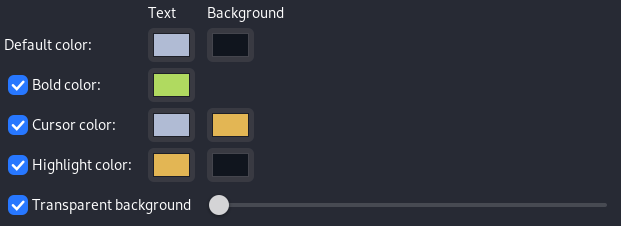
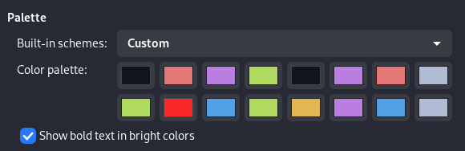
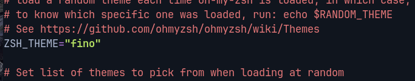
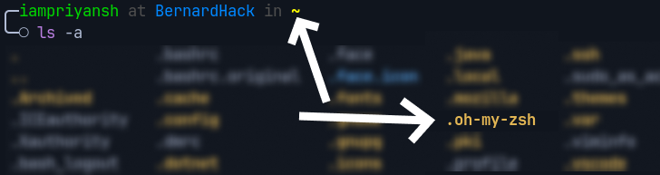

# Terminal Config
---
# Appereance

### Text

- **Terminal Size**
    
    Columns ↠ 80
    Rows ↠ 20
    
- **Font**
    
    Font Name ↠ [JetBrains Mono](https://fonts.google.com/specimen/JetBrains+Mono)
    Font Size ↠ 13px
    
- **Cell Spacing**
    
    Width ↠ 1.00
    Height ↠ 1.00
    
- **Cursor**
    
    Cursor Shape ↠ Underline
    Cursor blinking ↠ Default
    
- **Sound**
    
    Terminal Sound ↠ Disabled
    

### Colors

- **Text and Background Color ↠ Custom**
   
    <a herf="">Color Code</a>
    
- **Palette ↠ Custom**
    
    
 <a herf="">Color Code</a>
### Scrolling

Show Scrollbar ↠ Disabled
Scroll on output ↠ Disabled
Scroll on keystroke ↠ Enabled
Limit scroll back to ↠  Disabled

---
# OhmyZSH

### Installation

```jsx
git clone https://github.com/robbyrussell/oh-my-zsh.git ~/.oh-my-zsh
cp ~/.oh-my-zsh/templates/zshrc.zsh-template ~/.zshrc
cp ~/.oh-my-zsh/templates/zshrc.zsh-template ~/.zshrc
```

### Themes

• Find the line ZSH_THEME="robbyrussell" replace `robbyrussell` with fino theme in `.zshrc` File (**CTRL + X & Enter to Save**)



### Plugins

open `Terminal` and go to `home directory` 



```jsx
cd .oh-my-zsh/custom/plugins
git clone https://github.com/zsh-users/zsh-syntax-highlighting.git
git clone https://github.com/zsh-users/zsh-autosuggestions.git
```

• Find the line plugins=(

 and add the following lines in `.zshrc` File (**CTRL + X & Enter to Save**)

```
 sudo
web-search
copyfile
copybuffer
dirhistory
history
brew
vscode
xcode
torrent
toolbox
terraform
zsh-syntax-highlighting
zsh-autosuggestions
```


---
# HomeBrew

### Installation

go to `home directory` and open `terminal`

```jsx
git clone https://github.com/Homebrew/install.git
cd install && sudo bash ./install.sh
```

and follow the instruction. To verify homebrew is installed or not :

type “`brew config`" in terminal
